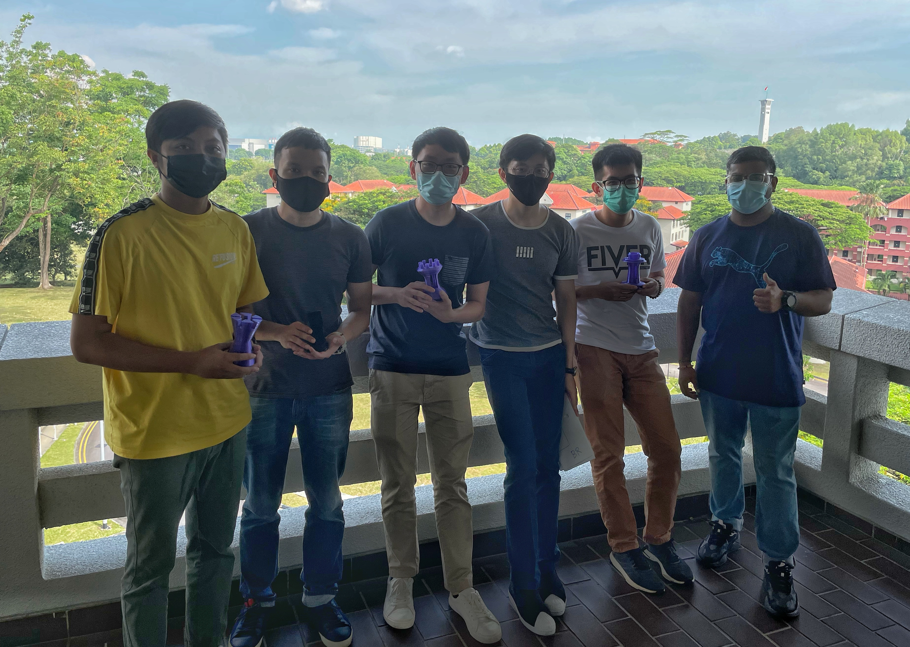
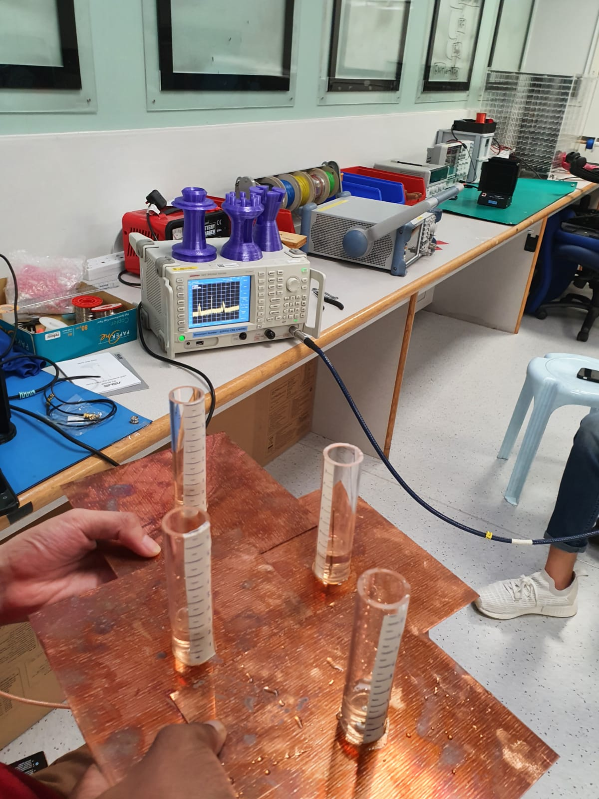

# Design & Innovation Project (DIP)

DIP is a module compulsory for all students in the school of electrical and electronic engineering (EEE),
Nanyang Technological University. Together with 5 other fellow students, my team worked together in
the project to design a water antenna. Unlike fixed-length antennas which have fixed operational
region, liquid-based antenna offers reconfigurability and flexibility due to the intrinsic properties of liquid.
This project involved first the modelling and simulation of a water antenna using Ansys HFSS(High frequency structure simulator)
before fabrication. In order to improve aesthetics of the water antenna, housings based on chess pieces were designed using Fusion360 and 3D-printed. 
Tests on the fabricated water antenna involving VNA (Vector Network Analyzer) and signal generator 
showed succes in both transmission and receving signals, with multiple water antenna offering some beam-steering abilities.
The project won the DIP competition where different groups compete within the same thematic programme (Photonics, Radar & Satellite Systems) in 2021.

Above: Team photo with some of us holding on to the water antenna housing. Left to right: Ryan, Yusuf, Qi Feng, Jian Xian, me, and Hareharan.

 Above: Water antenna testing with spectrum analyzer. 

