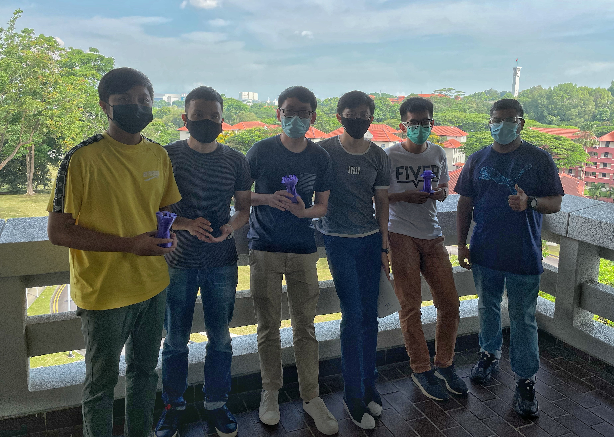

# Making and Tinkering (M&T)

In this module, my team consisting of fellow CN Yang Scholars from different faculties - Physics, Biology, and Environmental Science - came
together to realize a drone with a 360° video camera gimbal. In 2019, drones with full surrounding camera angle capabilities were not common or 
affordable, but we believe that such drones can be very helpful. With a fully controllable 360° video camera gimbal, drones can augment
many manual tasks such as building inspections at a height or through disaster effort. As such, my team decided to make work on this
meaningful project, with none of us having much experience or background in drones or cameras. It was therefore challenging to learn 
from scratch, especially with different backgrounds. However, that differences also allowed for a varied mix of perspectives
and ideas, where we tried to employ each of our strengths to complete the project. I focused on the circuitry and electronic components of the drone. At the same time, we shared our findings and learnings, and helped each other whenever possible,
allowing all of us to learn new skills and experiences at the same time. As the leader of the team, I am very honoured and glad to have worked with the brilliant and helpful members, where we struggled, learned and won the outstanding award together.

